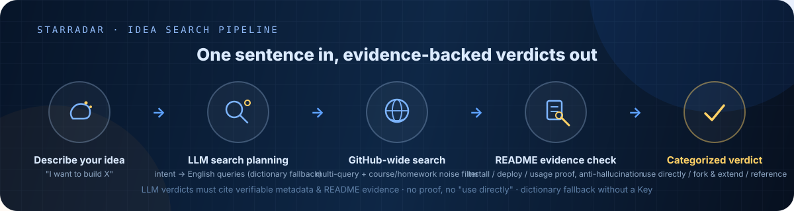
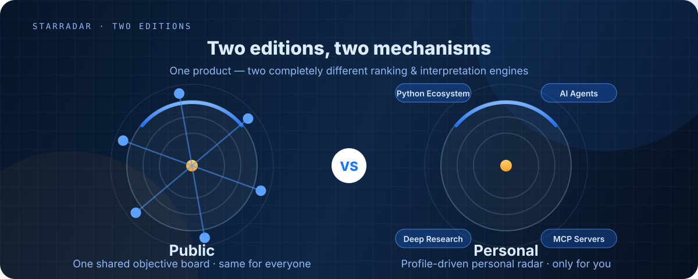
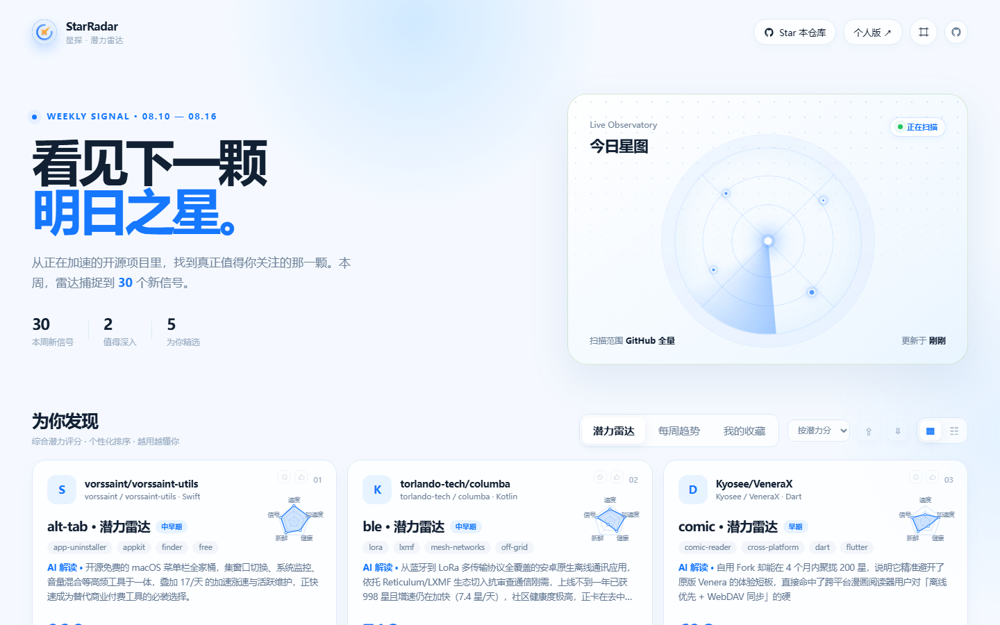
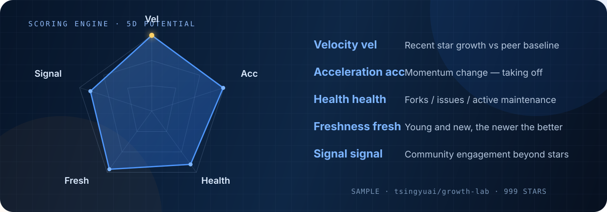

<p align="center">
  <a href="README.md">中文</a> · <b>English</b>
</p>

<p align="center">
  
</p>

<p align="center">
  <a href="https://2bingling.github.io/StarRadar/"></a>
  
  
  
  
  
</p>

---

## What is this

**Describe what you want to build in one sentence. Beacon searches all of GitHub and tells you which projects you can use directly, which are worth forking and extending, and which are reference-only — every verdict backed by README evidence and reasons, so you never reinvent the wheel.**

| What you do today | With Beacon |
| --- | --- |
| GitHub search qualifiers are hard; results drown in course assignments and toy projects | One Chinese/English sentence → auto-planned English queries + course/homework noise filtering |
| Trending only shows giants; great mid-tier projects stay invisible | The potential radar hunts 50–5000 star projects that are taking off |
| READMEs vary wildly; judging "can I build on this?" by eye is expensive | Automatic README install/deploy evidence check — no proof, no "use directly" verdict |
| You get a pile of links… now what? | Categorized verdicts: **use directly / fork & extend / reference only**, with the shortest path to a working MVP |

> **Core idea**: the AI may only conclude from verifiable metadata and README evidence. No deployment proof → no "use directly" verdict. Your explicit filters (language / license / stars) always outrank model suggestions.

---

## Idea search · what happens in one search

<p align="center">
  
</p>

Every result carries: **why it matches** (hit terms and reasons) · **raw README evidence** (install/deploy snippets with links to the source) · **a conservative recommendation** (license friendliness, maintenance activity). No LLM Key? It falls back to dictionary mode and says so in the results — never silently low-quality.

Search resources are gated: identical queries within 60s reuse the cached result, concurrent requests get an immediate "a search is already running" notice, and a 45s deadline returns metadata-level results first — a few extra clicks can't burn your GitHub quota.

---

## Two editions

<p align="center">
  
</p>

**One product, two editions** — the public edition answers "which projects are taking off this week", the personal edition answers "which projects fit me":

| | **Public edition** | **Personal edition** |
| --- | --- | --- |
| Mission | Objective discovery: one shared board, ready out of the box | Personalized picks: searched & interpreted only for you |
| Entry | **GitHub Pages live** (no install) or local `--serve` | "Personal ↗" top-right (`?personal=1`, **requires local `--serve`**) |
| Potential board | 5D potential score (dynamic size-class baseline, same for all) | Profile-driven search × 5D scoring × personalized interpretation |
| Weekly trends | TrendScore v2 momentum board (objective) | Same board + "this week's themes" interpreted for your profile |
| Cold start | No questionnaire, use immediately | Guided questionnaire (40 tags → cold-start profile) |
| AI | Rule-based interpretation | LLM edition: bring your own Key — interpretations / reasons / weekly report all from your profile |
| Data updates | GitHub Actions: daily 06:00 / weekly Monday 08:00 | Local server **auto-generates daily** + on-demand "Refresh" |

**Why two mechanisms**: the public edition is about credibility — the board must be identical for everyone to discuss and share; the personal edition is about knowing you — your profile drives search and interpretation. A thousand people, a thousand boards — that is the feature, not a flaw.

---

## Quick start

```bash
git clone https://github.com/2BingLing/StarRadar.git
cd StarRadar
pip install -r requirements.txt
cp .env.example .env        # GITHUB_TOKEN required; LLM_* optional (any OpenAI-compatible endpoint)

python src/main.py --serve  # local server → http://127.0.0.1:8970/ (personal edition: ?personal=1)
python src/main.py          # daily pipeline: collect → score → profile → explain → JSON
python src/main.py --weekly # build / refresh the weekly trend report
pytest                      # full test suite
```

**First-launch access code**: the local page has a shoulder-surfing gate. On first launch a random 6-digit code is generated, printed to the console, and saved to `data/profile/access_code.txt` (or pin one via the `STARRADAR_ACCESS_CODE` env var). It's a privacy gate, not a security boundary.

### Windows desktop build

The desktop app embeds the local server in a native window. Data, GitHub tokens and your profile live in `%LOCALAPPDATA%\StarRadar\`, never in the install directory.

```powershell
.\scripts\package_windows.ps1   # from the repo root
.\dist\StarRadar\StarRadar.exe
```

Desktop binds `127.0.0.1:8970` by default (auto-falls back to a free port). The access code lives at `%LOCALAPPDATA%\StarRadar\data\profile\access_code.txt`.

---
## Personal edition quick start

> ⚠️ **The personal edition needs a local backend**: profile search / LLM interpretations / questionnaire persistence / daily auto-generation all depend on local `--serve`. The GitHub Pages live site provides the **public edition only**.
> Live demo: https://2bingling.github.io/StarRadar/ (public edition)

```
① Run python src/main.py --serve → open http://127.0.0.1:8970/?personal=1
② Enter the access code → "Sign in with GitHub" → authorize once (zero config, token stays local)
③ Complete the cold-start questionnaire (guided wizard: 40 tags → size range → optional AI)
④ Data generates automatically: daily at 06:00 while the server runs; "⇄ Refresh data" anytime
⑤ Done ✓ — your personal radar is live and updates daily
```

**AI personalization (optional)**: bring your own LLM Key (OpenAI / DeepSeek / Zhipu / Qwen presets; OpenAI-compatible endpoints only) → auto-tested before saving → explanations / reasons / weekly report all generated from your profile. No key = rule mode.

**Data guarantees**: the questionnaire is stored twice (localStorage + local memory.db, auto-restored if browser storage is lost); personal data lives only in local `data/` (gitignored, never in the repo or on Pages).

---

## Screenshots

<p align="center">
  
  <br>
  <sub>Homepage · star map + potential radar (5D scoring)</sub>
</p>

<p align="center">
  
  <br>
  <sub>Weekly trends · momentum board</sub>
</p>

## Core capabilities

| Capability | Description |
| --- | --- |
| **Idea search (core)** | One sentence → evidence-based selection: LLM planning (dictionary fallback) → GitHub-wide multi-query → README evidence check → categorized verdicts (use directly / fork & extend / reference) + shortest MVP path |
| **Daily potential radar** | Multi-bucket sampling across 3 star ranges, noise filtering; 5D scoring: velocity · acceleration · community health · freshness · signal, benchmarked against same-size peers |
| **Weekly trend report** | TrendScore v2 momentum ranking; growth ticket gate keeps giants off; new stars / hot TOP / domain trends, cross-week tracking |
| **Personalized picks** | Personal edition: questionnaire → cold-start profile → behavior EMA updates + forgetting curve, daily recommendations that sharpen with use |
| **Star workspace** | Locally sync GitHub Stars with search, language / tag / archived filters, bulk tags, column layout, and inline notes; browse followed users' public Stars and a repository's Issues |
| **For you recommendations** | Finds unstarred public repositories from the Topics and languages of your recent Stars; every card shows its reason, research direction, review state, and note. Refreshes daily at 08:00 or on demand |
| **Cubby organizer** | Proposes local tags for a selected batch of Stars, lets you review or edit every proposal, then records an execution receipt. It never changes the original GitHub Stars |
| **Learning archive** | Turns GitHub, local, and tutorial projects into traceable records: purpose, structured AI analysis, learning time, changed files, next steps, and client-need mapping. Import from the Star library in one click |
| **AI explanations** | A "why it deserves attention" note per listed project, incrementally cached, graceful rule-text fallback; bring your own Key for full personalization |
| **GitHub native integration** | One-click login (OAuth device flow) → star · fork · copy clone command · notes · save to a local project library |

## 5D potential scoring

<p align="center">
  
</p>

All five dimensions are measured against a **dynamic baseline of same-size projects** — a rising mid-tier project can outscore a giant a hundred times its size.

---

## Sign-in mechanism & permissions

"Sign in with GitHub" uses the **OAuth Device Flow** (the Client ID is bundled as a public value — zero config for anyone who clones):

1. Sign in → GitHub asks for an 8-digit code → authorize once
2. The token returns directly to **your browser and stays local**
3. Scopes: `public_repo` (star / fork public repos) and `read:user` (username and avatar)

**Safety boundaries**:

- **The token never passes through any third party** — not the author's server, not a hosting platform, not a public proxy
- **The bundled Client ID is a public value** (not a secret); the Client Secret is never bundled or committed
- **The app only calls**: star/unstar, fork, reading your starred/repo info
- **Sign out anytime**: the page's "Sign out" clears the local token instantly; revoke at GitHub → Settings → Applications to kill it remotely
- **No data uploads**: questionnaire / behavior data is only persisted via local `--serve`; CORS defaults to a whitelist (Pages domain + loopback), so third-party pages can't silently call the local API
- **Recommendation snapshots stay local**: recommendations, review states, and notes are stored in `data/profile/recommendations/`; the feature reads only your authorized Stars and public GitHub repository data
- **Learning archives stay local**: projects, AI analyses, and learning logs are stored in `data/profile/memory.db`; a GitHub import reads the README, manifests, directory tree, and a few common entry files on demand, then the AI analyzes only that visible evidence plus your notes—it never claims to have read the whole codebase
- **LLM Key stays local**: browser localStorage + local `data/profile/llm_config.json` only; the public edition never touches it

---

## Structure / tech stack

| Layer | Contents |
| --- | --- |
| src/ | collector · analyzer · profile · reporter · search · web (local server + OAuth + scheduler) · personal |
| static/ | GitHub Pages frontend (vanilla JS): index.html · js/ · css/ · data/ (CI-generated JSON) |
| data/profile/ | memory.db (questionnaire + behavior + snapshots) + recommendations/ (local recommendation snapshots / notes) + gh_token.json / llm_config.json / access_code.txt |
| .github/ | daily.yml daily refresh · weekly.yml Monday report · Pages deployment |
| Backend | Python 3.10+ · SQLite · numpy · scikit-learn · BGE embeddings · HNSW · BM25 |
| Automation | GitHub Actions (public edition) + local scheduler (personal edition, daily 06:00) |

---

## License

[GNU Affero General Public License v3.0](LICENSE) — free to use and modify, but **derivative works and network services based on this project must be open-sourced under AGPL as well**.

---

<p align="center">
  
  <br>
  <sub>Find your starting point without reinventing the wheel · StarRadar</sub>
</p>
