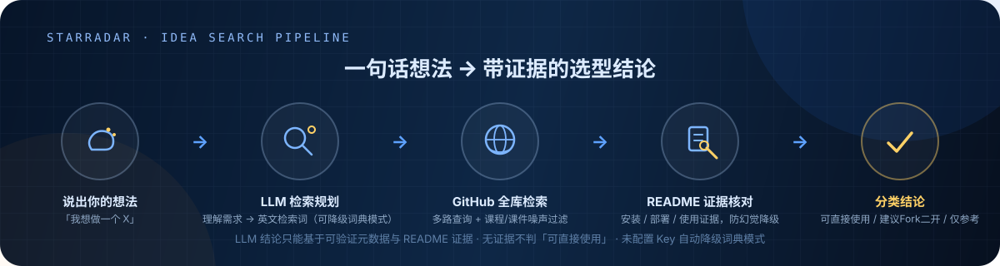
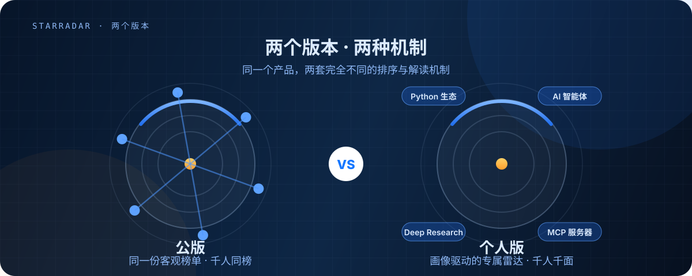

<p align="center">
  <b>中文</b> · <a href="README.en.md">English</a>
</p>

<p align="center">
  
</p>

<p align="center">
  <a href="https://2bingling.github.io/StarRadar/"></a>
  
  
  
  
  
</p>

---

## 这是什么

**一句话描述你想做的东西，StarRadar 在 GitHub 全库里找出：能直接用的、值得 Fork 二开的、仅值得参考的——每个结论都附带 README 证据和理由，不让你重复造轮子。**

| 你平时的做法 | 用 StarRadar 之后 |
| --- | --- |
| GitHub 搜索不会用限定符，结果混满课程作业和玩具项目 | 一句中文描述 → 自动规划英文检索词 + 课程/课件噪声过滤 |
| Trending 只有巨头，中量级好项目根本看不到 | 潜力雷达专挖 50~5000 星的「正在起飞」项目 |
| README 水平参差，肉眼判断「能不能二开」成本极高 | 自动核对 README 安装/部署证据，无证据不判「可直接使用」 |
| 搜到一堆链接，然后呢？ | 直接给分类结论：**可直接使用 / 建议 Fork 二开 / 仅值得参考**，附最短上手路径 |

> **核心理念**：AI 只能基于可验证的元数据与 README 证据下结论。没有部署证据就不判「可直接使用」；你的显式筛选（语言/许可证/星数）永远优先于模型建议。

---

## 想法搜索 · 一次搜索发生什么

<p align="center">
  
</p>

每一条结果都带：**为什么匹配**（命中词与理由）· **README 证据原文**（安装/部署片段直达原文链接）· **保守建议**（许可证是否友好、维护是否活跃）。未配置 LLM Key 时自动降级词典模式，并在结果里明示——不会静默给你低质量结果。

搜索资源有全局闸门：同一查询 60 秒内直接复用结果，并发请求立即提示「已有一笔搜索在进行中」，45 秒总闸超时先回元数据结果——不会连点几下就烧光 GitHub 配额。

---

## 两个版本 · 两种机制

<p align="center">
  
</p>

**StarRadar 是一个产品，两个版本**——公版回答「这周哪些项目在起飞」，个人版回答「哪些项目适合我」：

| | **公版**（给大家看） | **个人版**（给自己看） |
| --- | --- | --- |
| 定位 | 客观潜力发掘：同一份榜单，打开即用 | 专属雷达：只为你搜索与解读 |
| 入口 | **GitHub Pages 在线版**（无需安装）或本地 `--serve` | 右上角「个人版 ↗」（`?personal=1`，**需本地运行 `--serve`**） |
| 潜力雷达 | 五维潜力分排序（动态基准，**千人同榜**） | 画像驱动搜索 × 五维评分 × 个性化解读（**千人千面**） |
| 每周趋势 | TrendScore v2 增长动能周榜（客观） | 同一份客观榜单 + 按你的画像解读「本周主线」 |
| 冷启动 | 无问卷，打开即用 | **问卷强制引导**（40 标签 → 冷启动画像） |
| AI 能力 | 数据规则版解读 | **LLM 版**：填你自己的 Key，解读 / 推荐理由 / 周报全部按画像生成 |
| 数据更新 | GitHub Actions 每日 06:00 / 每周一 08:00 自动部署 | 本地服务**每日自动生成** + 页面「刷新数据」随时手动触发 |

**为什么是两套机制**：公版的核心是「公信力」——榜单必须对所有人一致才能被讨论、引用、转发；个人版的核心是「懂你」——画像（问卷 + 我的加星 + 行为记忆）驱动搜索与解读，千人千面是特性不是缺陷。

---

## 快速开始

```bash
git clone https://github.com/2BingLing/StarRadar.git
cd StarRadar
pip install -r requirements.txt
cp .env.example .env        # GITHUB_TOKEN 必填；LLM_* 可选（DeepSeek 等 OpenAI 兼容端点）

python src/main.py --serve  # 本地服务 → http://127.0.0.1:8970/（个人版 ?personal=1）
python src/main.py          # 每日管道：采集 → 评分 → 画像 → 解读 → 生成 JSON
python src/main.py --weekly # 生成 / 刷新每周趋势周报
pytest                      # 全量测试
```

**首次启动的访问码**：本地页面有「防窥」门禁。首次启动会自动生成 6 位随机访问码，在控制台打印并存入 `data/profile/access_code.txt`（也可用环境变量 `STARRADAR_ACCESS_CODE` 固定）。门禁定位是防同事窥屏，不是安全边界。

### Windows 桌面版打包

桌面版将本地服务嵌入原生窗口。运行数据、GitHub 登录 Token 和个人画像保存在 `%LOCALAPPDATA%\StarRadar\`，不写入安装目录。

```powershell
.\scripts\package_windows.ps1   # 项目根目录执行
.\dist\StarRadar\StarRadar.exe
```

桌面版默认绑定 `127.0.0.1:8970`（被占用时自动换空闲端口）。访问码在 `%LOCALAPPDATA%\StarRadar\data\profile\access_code.txt`。

---
## 个人版上手

> ⚠️ **个人版需要本地后端**：专属雷达数据（画像搜索 / LLM 解读 / 问卷落库 / 每日自动生成）全部依赖本地 `--serve`。GitHub Pages 在线版仅提供**公版**功能。
> 在线体验：https://2bingling.github.io/StarRadar/（公版）

```
① 运行 python src/main.py --serve → 打开 http://127.0.0.1:8970/?personal=1
② 输入访问码 → 点「通过 GitHub 登录」→ 授权一次（零配置，Token 只存本机）
③ 完成冷启动问卷（引导式向导：40 标签 → 体量区间 → AI 个性化可选）
④ 数据自动生成：服务开着每天 06:00 自动跑；想立即刷新点「⇄ 刷新数据」
⑤ 完成 ✓ —— 你的专属雷达上线，每天自动更新
```

**AI 个性化（可选）**：填入你自己的 LLM Key（OpenAI / DeepSeek / 智谱 / 通义 一键预设，仅支持 OpenAI 兼容接口）→ 保存前自动测试连通 → 解读 / 推荐理由 / 周报全部按你的画像生成。不填则规则模式。

**数据保障**：问卷 localStorage + 本地 memory.db 双份存储（浏览器存储丢失自动恢复）；个人数据只存本机 `data/`（gitignore，不进仓库、不上 Pages）。

---

## 界面

<p align="center">
  
  <br>
  <sub>首页 · 今日星图 + 潜力雷达（五维评分）</sub>
</p>

<p align="center">
  
  <br>
  <sub>每周趋势 · 增长动能周榜</sub>
</p>

## 核心能力

| 能力 | 说明 |
| --- | --- |
| **想法搜索（核心）** | 一句话 → 证据化选型：LLM 检索规划（可降级词典模式）→ GitHub 全库多路检索 → README 证据核对 → 分类结论（可直接使用 / 建议 Fork 二开 / 仅参考）+ 最短 MVP 路径 |
| **每日潜力雷达** | 3 个 Star 区间多桶采样，过滤课程 / 课件 / 镜像噪声；五维评分：速度 · 加速度 · 社区健康 · 新鲜度 · 信号，动态基准对比同规模项目 |
| **每周趋势周报** | TrendScore v2 增长动能排序；增速门票制，巨无霸不进榜；新星 / 热度 TOP / 领域走势四大板块，跨周追踪 |
| **为你精选** | 个人版专属：问卷 → 冷启动画像 → 行为 EMA 增量更新 + 遗忘曲线，每日生成专属推荐（越用越准） |
| **AI 中文解读** | 每个上榜项目生成「为什么值得关注」解读，增量缓存，失败自动降级规则文本；个人版可填自己的 Key 全量个性化 |
| **GitHub 原生集成** | 一键登录（OAuth 设备流零配置）→ 网页内直接加星 · Fork · 复制克隆命令 · 随行笔记 · 收藏到本机项目库 |

## 五维潜力评分

<p align="center">
  
</p>

五个维度都以**同规模项目的动态基准**为参照，而非绝对值——「正在起飞」的中量级项目，评分可以高过百倍体量的老牌仓库。

---

## 登录机制与权限说明

「通过 GitHub 登录」采用 **OAuth 设备流**（Client ID 已内置为公开值，克隆者零配置）：

1. 点击登录 → 打开 GitHub 页面输入 8 位授权码 → 确认授权
2. GitHub 签发的 token 直接回到你的浏览器，**仅存本机**
3. 授权页展示的权限为 `public_repo`（对公开仓库加星 / Fork）与 `read:user`（读取用户名与头像）

**安全边界**：

- **Token 不经过任何第三方**——不经作者服务器、不经托管平台、不经公共代理
- **内置 Client ID 是公开值**（非机密）；Client Secret 永不内置、永不入库
- **应用只调用**：加星/取消星、Fork、读取你的星标与仓库信息
- **随时可退出**：页面「退出登录」立即清除本机 token；也可在 GitHub → Settings → Applications 撤销授权
- **数据不上传**：问卷 / 行为数据仅在本地 `--serve` 时落库；CORS 默认白名单（Pages 域名 + 本机回环），第三方网页无法静默调用本机 API
- **LLM Key 仅本机流转**：只存浏览器 localStorage + 本地 `data/profile/llm_config.json`，公版不涉及、不上传任何第三方

---

## 目录 / 技术栈

| 层 | 内容 |
| --- | --- |
| src/ | collector（采集）· analyzer（评分）· profile（画像 / 推荐）· reporter（周报 / LLM 解读）· search（语义搜索）· web（本地服务 + OAuth + 自动调度）· personal（个人版管道） |
| static/ | GitHub Pages 前端（原生 JS，零框架）：index.html · js/ · css/ · data/（CI 生成 JSON） |
| data/profile/ | memory.db（问卷 + 行为 + 快照）+ gh_token.json / llm_config.json / access_code.txt（登录、LLM 与访问码配置） |
| .github/ | daily.yml 每日刷新 · weekly.yml 周一周报 · Pages 部署 |
| 后端 | Python 3.10+ · SQLite · numpy · scikit-learn · BGE 嵌入 · HNSW · BM25 |
| 自动化 | GitHub Actions（公版）+ 本地服务后台调度（个人版每日 06:00） |

---

## License

[GNU Affero General Public License v3.0](LICENSE) — 允许自由使用与修改，但**衍生作品及基于本项目的网络服务必须同样以 AGPL 开源**。

---

<p align="center">
  
  <br>
  <sub>一句话找到不重复造轮子的起点 · StarRadar</sub>
</p>
